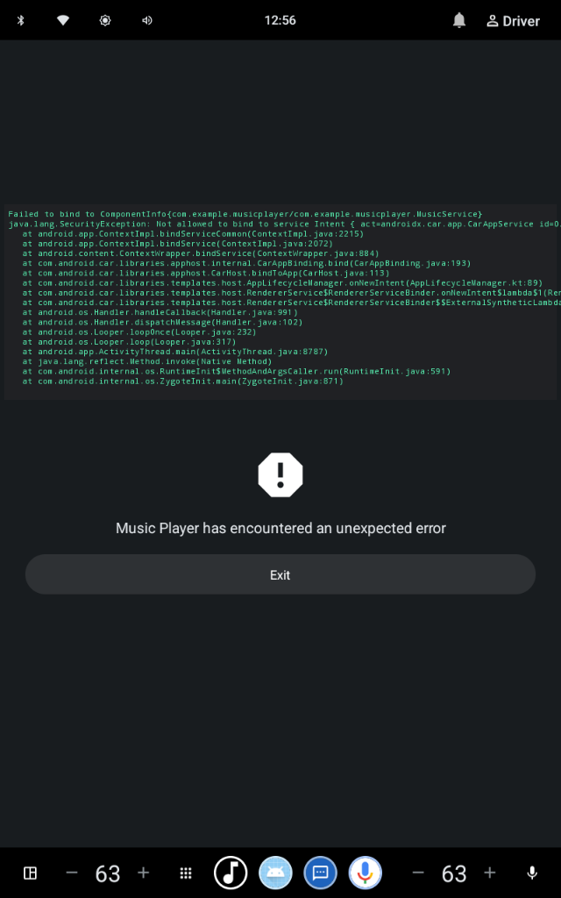

# AAOS Custom Media Player

A native music streaming application built specifically for **Android Automotive OS (AAOS)**. 

Unlike standard Android mobile apps, this project uses the Android Automotive Media Template architecture to plug directly into the car's built-in Media Center. This ensures the app complies with strict driver-distraction guidelines and seamlessly integrates with the car's hardware controls.

## 📸 Preview

## 🎵 Features
* **Native OS Integration**: Uses `MediaBrowserServiceCompat` to render UI completely through the car's native Media Center.
* **Persistent Controls**: Playback controls automatically dock to the persistent bottom bar of the car's infotainment system.
* **ExoPlayer Audio Engine**: Reliable streaming of remote audio files over the internet.
* **Media Sessions**: Full support for `MediaSessionCompat`, allowing the car's steering wheel controls and hardware buttons (Play, Pause, Next, Previous) to control the app.
* **Automotive Metadata**: Custom `automotive_app_desc.xml` to declare the app as a legitimate media source in the AAOS app selector.

## 🛠 Tech Stack
* Kotlin
* AndroidX Media (`MediaBrowserServiceCompat`, `MediaSessionCompat`)
* Google ExoPlayer

## 🚀 How to Run
1. Open the project in **Android Studio**.
2. Run the application on an **Automotive with Play Store** emulator (API 32+ recommended).
3. The app will automatically launch the Native Media Center and set itself as the active media source.
4. *(Optional)* If the Media Center doesn't open automatically, launch the car's **Media** app and click the App Selector in the top-left corner to choose "Music Player".
